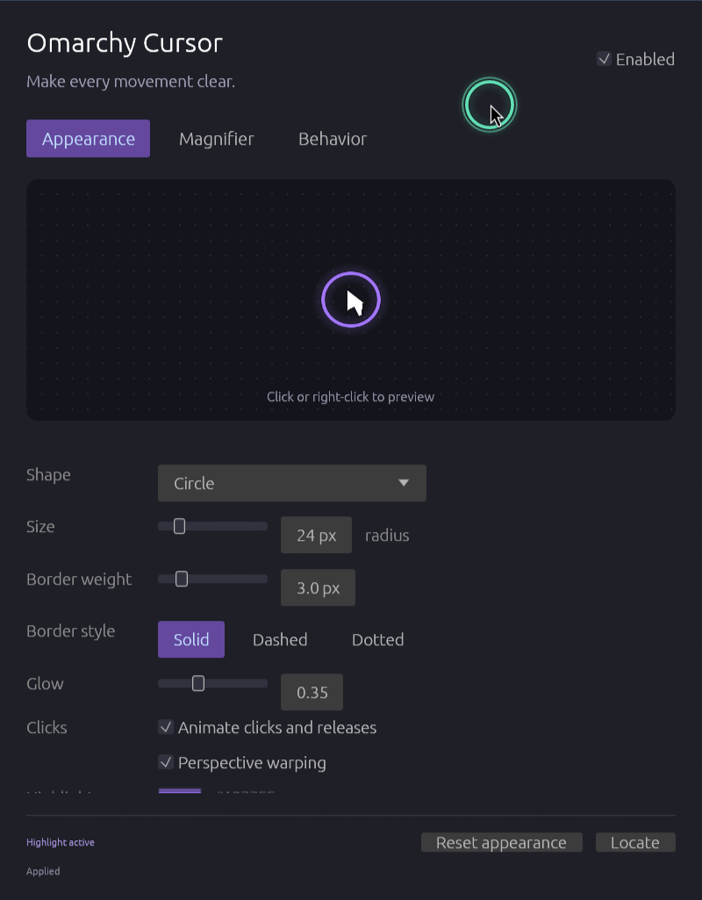
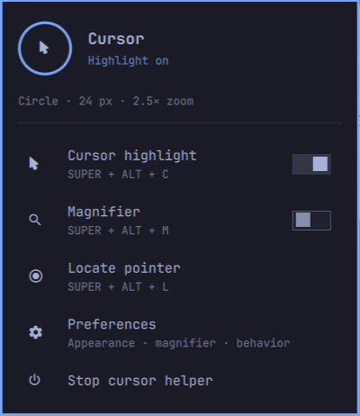
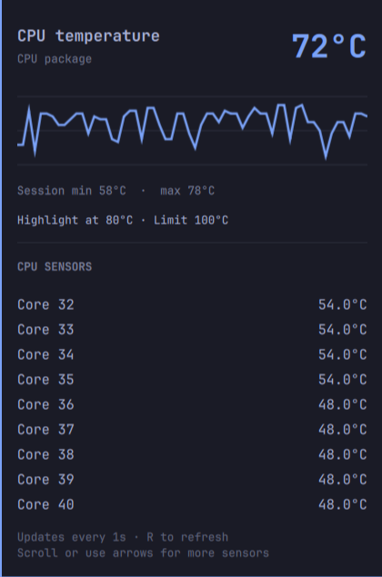

# omarchy-widgets

Custom status-bar widgets for the [Omarchy](https://omarchy.org/) shell
(Quickshell). Each widget is a self-contained plugin directory under
`plugins/` that drops into `~/.config/omarchy/plugins/`.

| Widget | What it does | Right-click |
|---|---|---|
| `dev.screenshot` | Camera icon with a popup menu: **Select area**, **Window**, **Full screen** (each copies to the clipboard *and* saves a PNG), **Copy text** (OCR), **Open folder** | Start an area capture immediately |
| `dev.cpu` | Live CPU % pill; popup shows load, clock, temperature and the top CPU processes | Open `btop` |
| `dev.cpu-temperature` | Live CPU temperature in °C; popup shows recent history, session min/max and package/core sensors | Open `btop` |
| `dev.ram` | Live memory usage; popup shows totals and the top memory processes | Open `btop` |
| `dev.disk` | Live disk usage for a mount; popup lists filesystems and top I/O processes | Open `btop` |
| `dev.cursor` | Cursor highlight and live magnifier; popup has enable, magnify, locate, preferences, and stop controls | Toggle highlight (middle-click: magnifier) |

All popups support keyboard navigation (arrows / Enter / Esc / Tab between panels).

## Install

```bash
git clone git@github.com:tluanga-dev/omarchy-widgets.git
cd omarchy-widgets
./install.sh              # all widgets
./install.sh dev.screenshot   # or just one
./install.sh dev.cursor       # builds the Rust helper and installs the cursor widget
./install.sh dev.cpu-temperature # CPU thermometer, refreshed every second
```

`install.sh` copies the plugin directories into `~/.config/omarchy/plugins/`
and appends any widget not already in your bar to its default section in
`~/.config/omarchy/shell.json` (Cursor: center; other widgets: right).
Move them around with:

```bash
omarchy bar move dev.screenshot --section right
```

The cursor widget also builds and installs the Rust app in
[`apps/omarchy-cursor`](apps/omarchy-cursor). It uses a click-through Wayland
overlay, with circle/squircle/rhombus/rectangle highlights, click animations,
custom colors and glow, idle hiding, and a live 1.5–10× magnifier. Its preferences
window includes a preview and adjustable shortcuts:

| Shortcut | Cursor action |
|---|---|
| Super + Alt + C | Toggle highlight |
| Super + Alt + M | Magnifier (toggle, or hold mode in preferences) |
| Super + Alt + L | Locate the pointer |

The bar widget starts the helper when loaded; **Stop cursor helper** stops it
until you start it again or the widget reloads. Set `autoStart: false` to start
manually. The standalone tray icon is disabled when installed as a widget.
The lens appears beside the pointer to avoid capturing itself. See the
[app README](apps/omarchy-cursor/README.md) for details and removal instructions.

Click **Cursor** in the top bar to open its popup, right-click to toggle the
highlight, or middle-click to toggle the magnifier. To move an existing
installation beside the screenshot button:

```bash
omarchy bar move dev.cursor --section center --after dev.screenshot
```




The separate [CPU Temperature widget](plugins/dev.cpu-temperature/README.md)
reads the CPU package/die sensor once per second, with a popup for recent history
and individual core readings. Put it beside CPU usage with
`omarchy bar move dev.cpu-temperature --section right --after dev.cpu`.



## Settings

Each widget's `manifest.json` declares its settings; they show up in the
bar's widget settings UI and can also be set inline in `shell.json`:

```jsonc
{ "id": "dev.screenshot", "directory": "~/Documents/Screenshots" }
{ "id": "dev.cpu",  "interval": 1, "groupByName": true, "topCount": 5 }
{ "id": "dev.cpu-temperature", "interval": 1, "warningTemperature": 80 }
{ "id": "dev.ram",  "interval": 1, "showPercent": true, "groupByName": true, "topCount": 5 }
{ "id": "dev.disk", "interval": 1, "mount": "/", "groupByName": true, "topCount": 5 }
{ "id": "dev.cursor", "autoStart": true }
```

## Requirements

- Omarchy with the Quickshell-based `omarchy-shell`
- `dev.screenshot` uses Omarchy's own capture tools (`omarchy-capture-screenshot`,
  `omarchy-capture-text`, `grim`, `slurp`, `wl-copy`) — all ship with Omarchy
- `jq` (for `install.sh` to edit `shell.json`; ships with Omarchy)
- `dev.cpu-temperature`: Python 3 and a readable CPU sensor in Linux sysfs.
- `dev.cursor`: Rust 1.95+, Omarchy 4 with Hyprland 0.56 Lua configuration, a
  systemd user session, and OpenGL/Wayland. Other widgets do not require Rust.

## Development notes

- Plugin code under `~/.config/omarchy/plugins/` hot-reloads on save, but an
  edit to an already-loaded QML file can keep being served from Qt's
  component cache. If a change seems ignored, `omarchy restart shell`.
- Shell log for debugging QML errors:
  `/run/user/$UID/quickshell/by-pid/$(pgrep -f 'quickshell -n -p')/log.log`
- Use `Util.shellQuote()` (from `qs.Commons`) when building shell commands
  for `bar.run()`; the bar API itself has no quoting helper.

## License

MIT
